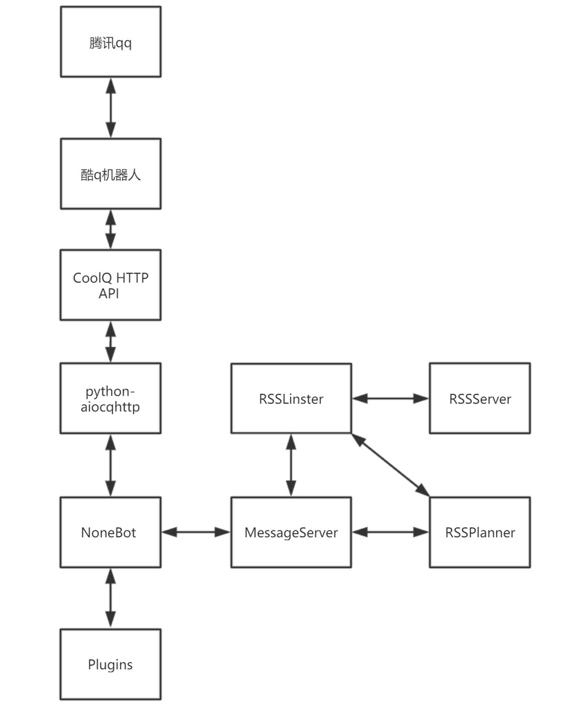
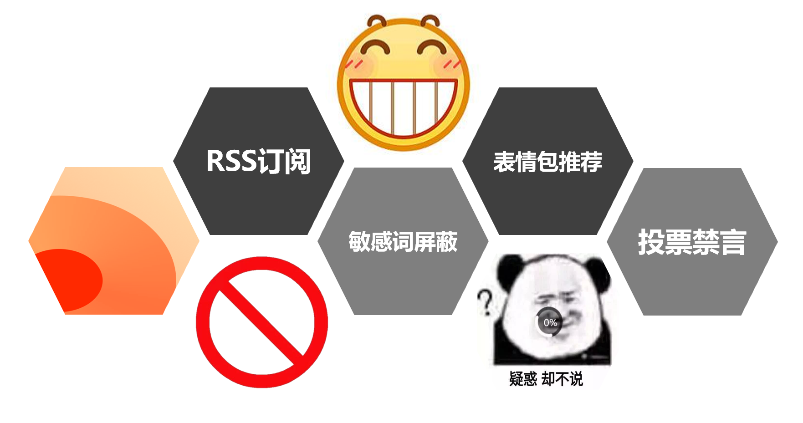
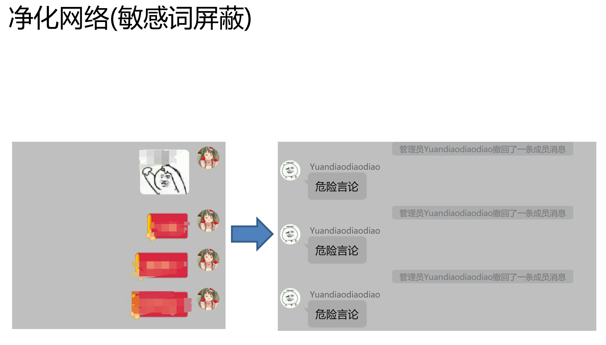
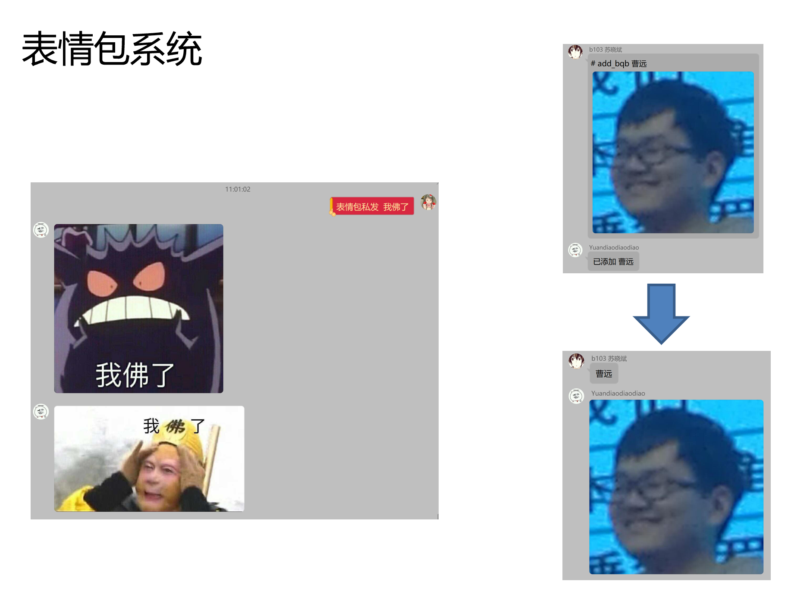
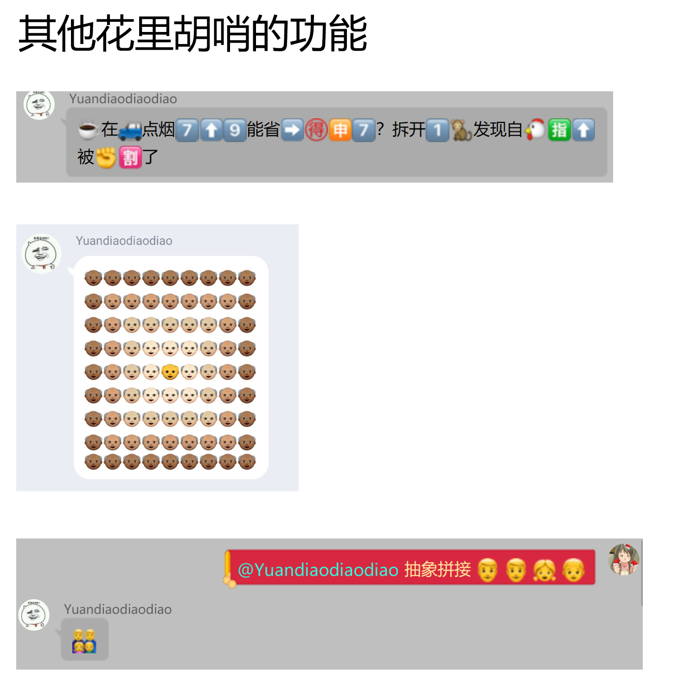

# toolman
##### hackSDU Project  
## 各种bug
- apt-get install python3-dev
- /etc/timezone 中的时区要和系统时区对应  
## 部署  
- 需求>=python3.6  
- docker(linux)  
### 1配置文件
-  myConfig/config.json.example 重命名为
    myConfig/config.json 根据json内的注释自行配置
### 2安装依赖  
- git clone 仓库.git
- cd toolman
- python install.py <python名字> <pip名字>
- 如 python install.py python3 pip3
### 3部署酷q和CQHTTP
- 运行 python build.py
- 对于win 可执行文件位于 env_windows/
- 对于linux 将自动构建docker  
 通过访问localhost:coolqVNC连入远程桌面
 输入密码VNC_PASSWD进入
### 4部署nonebot和RSS
- 运行 python run.py 并守护进程  

## TODO
- 百度云离线下载局域网秒传
- 百度云文库下载器
- 表情包unique搜索
- 和他对线
- waifu2x
- 二维码生成
- 图片库 tag标注 图片相似度合并
- 天气预警
- 色图库
- 赛🐎
- 互动视频图文

## ppt&&简介

